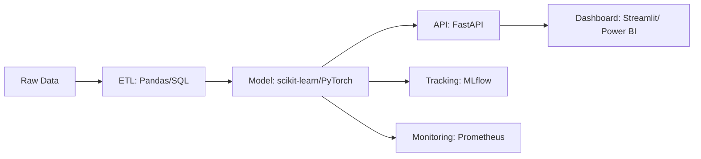

## Hi there 👋

<!--
**Thizisfranklin/Thizisfranklin** is a ✨ _special_ ✨ repository because its `README.md` (this file) appears on your GitHub profile.

<!-- Profile README for Franklin Osualaaham -->
<!-- Tip: this repo must be named exactly your GitHub username: Thizisfranklin -->

<!-- Animated header -->

<!-- Fun coder GIF -->

### Full‑Stack Data Scientist → Aspiring **ML Engineer**
**ETL → ML → MLOps → Dashboards** • Python • SQL • PyTorch • Docker • AWS/GCP

<i>“🧹 ETL for breakfast, 📈 ROC for lunch; 📊 dashboards for dinner — 🔍🤖 explainable models my mom can trust.”</i>

---

## 💫 About Me
- 🎓 Data Science @ **UTA ’26**
- 💼 Amazon **Operational Strategy & People Analytics** Extern
- 🧭 **McKinsey Forward** Fellow • **ColorStack** Fellow
- 🧠 Interests: LLMs, NLP, ML systems, monitoring & explainability
- 🎯 Long‑term goal: **Machine Learning Engineer** who builds reliable, explainable AI

---

## 🧰 Tech Stack

  

---

## 📐 What I Build (E2E ML)

> End‑to‑end pipelines from data to deployable, explainable services.

---

## 🚀 Current Focus
- **Train → Serve → Monitor** workflows (FastAPI + Docker + AWS/GCP)
- **NLP/LLM** projects: embeddings, retrieval, prompt/eval, guardrails
- **Experimentation** & KPI dashboards teammates actually use

---

## 💡 Here are some ideas to get you started
- 🔭 I’m currently working on **business‑focused** data & ML projects (clear KPIs → measurable impact).
- 🌱 I’m learning **advanced machine learning** (tree ensembles, gradient boosting, deep learning) and **Generative AI** (LLMs, RAG, prompt evaluation, guardrails).
- 👯 I’m looking to collaborate on **end‑to‑end ML pipelines**, **NLP/LLM apps**, and **sports analytics**.
- ⚡ **Fun fact — Football & coaching:** I’m an avid Football ( which some refer to as Soccer😁) fan.
  - One day I’d love to coach—bringing a data-informed, people-first style

## 🗂️ Featured Project

**Mushroom‑Edibility‑Prediction** — Supervised learning to classify edible vs. poisonous mushrooms, with a clean preprocessing pipeline, baseline models, and evaluation (ROC/AUC, F1, confusion matrix).

---

## 📊 GitHub Stats

  

---

## 🧭 Roadmap → ML Engineer
- ✅ Stats/ML fundamentals • **Python/SQL** mastery
- ✅ Reproducible pipelines (venv/conda, Make, **Docker**)
- ✅ **MLOps**: versioning (DVC/Git), experiment tracking (**MLflow**)
- ▶️ Serving: **FastAPI**, gRPC, vector search
- ▶️ Cloud: **AWS (SageMaker)** / **GCP (Vertex AI)**, CI/CD
- ▶️ Reliability: evals, monitoring, data quality checks
- 🔜 Systems for **LLMs**: RAG, prompt pipelines, structured evals

---

## 📝 I Write / Share
- Notes & mini‑guides on ML engineering
- Short posts: “Perplexity down, vibes up.”
- Occasional dashboards that even mom can read 😄

---

## 🌐 Connect

  
  

---

<!-- Typing banner -->

  

---

<!-- Footer -->

